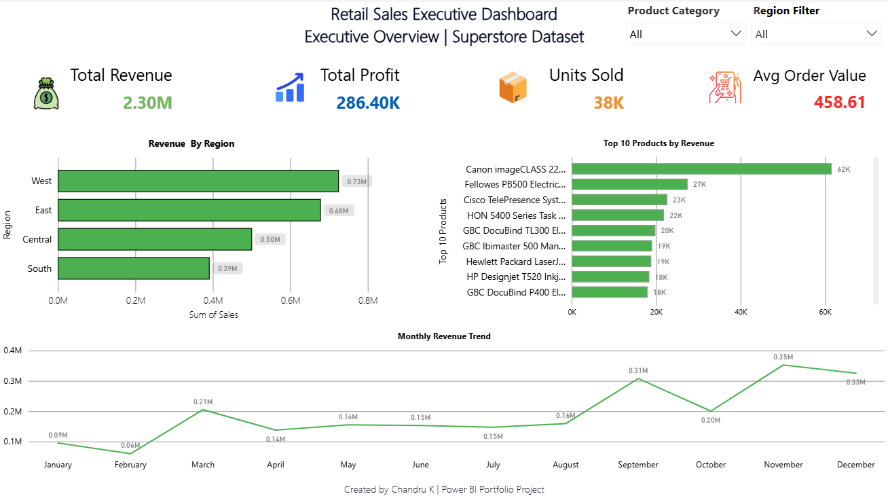
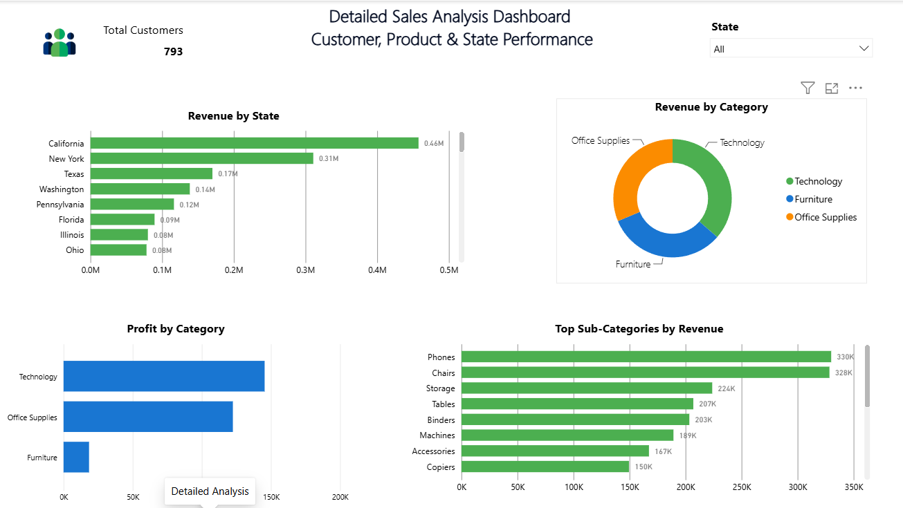

# Retail Sales Data Warehouse and Executive Dashboard (SQL + Power BI)

An end-to-end retail analytics project: raw Superstore data (Kaggle) is
cleaned, loaded into a SQL data warehouse, analysed with SQL queries, and
presented in an interactive Power BI executive dashboard.

## Business problem
Retail managers need a single view of sales, profit and regional
performance to decide where to grow and what to fix.

## Workflow
1. **Data cleaning:** removed duplicates, fixed data types and handled
   missing values in Python (`data_cleaning.ipynb`)
2. **Data warehouse:** created tables and loaded cleaned data with SQL
   (`create_tables.sql`)
3. **Analysis:** wrote SQL queries for sales, profit and customer
   insights (`Sales_analysis_queries.sql`)
4. **Dashboard:** built an executive dashboard in Power BI
   (`Retail Sales Executive Dashboard.pbix`)

## Dashboard preview

## Key insights
- Total sales: [$2.30M]
- Total profit: [$286.4K]
- Best performing region: [West ($0.73M)]
- Top product category: [Technology (highest profit)]
- Biggest problem area (for example, a loss-making category): [Furniture (lowest profit of the three categories)]

## Tools used
Python (pandas), SQL, Power BI, Excel/CSV

## Files
| File | Purpose |
|---|---|
| `superstore_raw.csv.csv` | Original dataset |
| `cleaned_superstore.csv` | Cleaned dataset |
| `data_cleaning.ipynb` | Cleaning steps |
| `create_tables.sql` | Warehouse table creation |
| `Sales_analysis_queries.sql` | Analysis queries |
| `Retail Sales Executive Dashboard.pbix` | Power BI dashboard |
